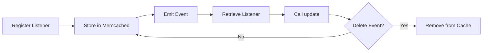

## Overview

Aeros provides an event system based on the Observer pattern, allowing you to decouple components and trigger actions in response to events throughout your application.

## How It Works

The event system consists of two main components:

1. **Observable** - Abstract class that defines event listeners
2. **Event** - Class that manages event registration and emission

Events are stored in Memcached and can be triggered on-demand or automatically deleted after execution.

## Creating Event Listeners

All event listeners must extend the `Observable` abstract class:

```php app/Events/UserRegisteredEvent.php
use Aeros\Src\Classes\Observable;

class UserRegisteredEvent extends Observable
{
    public function update(mixed $eventData): bool
    {
        // Extract user data
        $user = $eventData;
        
        // Send welcome email
        $job = new SendEmailJob(
            $user['email'],
            'Welcome to our platform!',
            "Hello {$user['name']}, welcome!"
        );
        
        queue()->push($job);
        
        // Log the registration
        logger()->log("New user registered: {$user['email']}");
        
        return true;
    }
}
```

<Info>
The `update()` method receives the event data and must return a boolean indicating success or failure.
</Info>

## Registering Event Listeners

Register event listeners using the `addEventListener()` method:

```php
// Register a single event
event()->addEventListener('user.registered', UserRegisteredEvent::class);

// Register the same listener for multiple events
event()->addEventListener(
    ['user.registered', 'user.imported'],
    UserRegisteredEvent::class
);
```

<Warning>
The event listener class must exist and extend `Observable`, otherwise a `TypeError` will be thrown.
</Warning>

## Emitting Events

Trigger events using the `emit()` method:

```php
// Simple event emission
$userData = [
    'name' => 'John Doe',
    'email' => 'john@example.com',
];

event()->emit('user.registered', $userData);
```

### One-Time Events

Automatically delete events after emission:

```php
// Emit and delete the event listener
event()->emit('user.registered', $userData, true);

// Subsequent calls won't trigger anything
event()->emit('user.registered', $otherUser); // Returns false
```

## Event Lifecycle



## Practical Examples

### Example 1: User Lifecycle Events

```php app/Events/UserDeletedEvent.php
class UserDeletedEvent extends Observable
{
    public function update(mixed $eventData): bool
    {
        $userId = $eventData['id'];
        
        // Clean up user data
        cache('redis')->del("user:{$userId}");
        cache('redis')->del("session:user:{$userId}");
        
        // Remove from search index
        search()->remove('users', $userId);
        
        // Log deletion
        logger()->log("User {$userId} deleted and cleaned up");
        
        return true;
    }
}
```

Register and use:

```php
// Register during application bootstrap
event()->addEventListener('user.deleted', UserDeletedEvent::class);

// Trigger when deleting a user
function deleteUser($userId) {
    // Delete from database
    db()->query('DELETE FROM users WHERE id = ?', [$userId]);
    
    // Trigger cleanup event
    event()->emit('user.deleted', ['id' => $userId]);
}
```

### Example 2: Order Processing

```php app/Events/OrderCreatedEvent.php
class OrderCreatedEvent extends Observable
{
    public function update(mixed $eventData): bool
    {
        $order = $eventData;
        
        // Send confirmation email
        queue()->push(new SendOrderConfirmationJob($order));
        
        // Update inventory
        queue()->push(new UpdateInventoryJob($order['items']));
        
        // Notify admin
        queue()->push(new NotifyAdminJob('New order', $order));
        
        // Track analytics
        analytics()->track('order.created', [
            'order_id' => $order['id'],
            'total' => $order['total'],
        ]);
        
        return true;
    }
}
```

```php
event()->addEventListener('order.created', OrderCreatedEvent::class);

// In your order creation logic
function createOrder($orderData) {
    // Save to database
    $orderId = db()->insert('orders', $orderData);
    $orderData['id'] = $orderId;
    
    // Trigger event
    event()->emit('order.created', $orderData);
    
    return $orderId;
}
```

### Example 3: Multi-Step Workflow

```php app/Events/DocumentUploadedEvent.php
class DocumentUploadedEvent extends Observable
{
    public function update(mixed $eventData): bool
    {
        $document = $eventData;
        
        // Queue document processing jobs
        queue()->push(new GenerateThumbnailJob($document), 'documents');
        queue()->push(new ExtractTextJob($document), 'documents');
        queue()->push(new VirusScanJob($document), 'documents');
        
        return true;
    }
}

class DocumentProcessedEvent extends Observable
{
    public function update(mixed $eventData): bool
    {
        $document = $eventData;
        
        // Notify user
        $user = db()->query('SELECT email FROM users WHERE id = ?', [$document['user_id']]);
        queue()->push(new SendEmailJob(
            $user['email'],
            'Document Ready',
            'Your document has been processed'
        ));
        
        return true;
    }
}
```

## Event Validation

The event system validates that listeners extend `Observable`:

```php
try {
    event()->addEventListener('invalid.event', 'InvalidClass');
} catch (\TypeError $e) {
    // ERROR[event] Event "InvalidClass" were not found or invalid.
    logger()->log($e->getMessage());
}
```

## Method Chaining

The `addEventListener()` method returns the Event instance for chaining:

```php
event()
    ->addEventListener('user.created', UserCreatedEvent::class)
    ->addEventListener('user.updated', UserUpdatedEvent::class)
    ->addEventListener('user.deleted', UserDeletedEvent::class);
```

## Best Practices

<CardGroup cols={2}>
  <Card title="Descriptive Event Names" icon="tag">
    Use clear, namespaced event names like `user.registered`, `order.completed`, or `payment.failed`.
  </Card>
  
  <Card title="Lightweight Handlers" icon="feather">
    Keep event handlers fast and lightweight. Queue heavy tasks as jobs instead of executing them directly.
  </Card>
  
  <Card title="Return Boolean" icon="check">
    Always return `true` or `false` from the `update()` method to indicate success or failure.
  </Card>
  
  <Card title="Handle Errors" icon="shield">
    Wrap event logic in try-catch blocks to prevent one event handler from crashing the entire flow.
  </Card>
  
  <Card title="Document Events" icon="book">
    Maintain a list of application events and their expected data structures.
  </Card>
  
  <Card title="Use One-Time Events" icon="clock">
    For events that should only trigger once, use the `deleteEvent` parameter.
  </Card>
</CardGroup>

## Advanced: Event Registry

Create a centralized event registry for better organization:

```php app/Events/EventRegistry.php
class EventRegistry
{
    public static function register(): void
    {
        // User events
        event()->addEventListener('user.registered', UserRegisteredEvent::class);
        event()->addEventListener('user.updated', UserUpdatedEvent::class);
        event()->addEventListener('user.deleted', UserDeletedEvent::class);
        
        // Order events
        event()->addEventListener('order.created', OrderCreatedEvent::class);
        event()->addEventListener('order.completed', OrderCompletedEvent::class);
        event()->addEventListener('order.cancelled', OrderCancelledEvent::class);
        
        // Document events
        event()->addEventListener('document.uploaded', DocumentUploadedEvent::class);
        event()->addEventListener('document.processed', DocumentProcessedEvent::class);
    }
}
```

Call during bootstrap:

```php bootstrap.php
EventRegistry::register();
```

## Configuration

The event system uses Memcached by default. Ensure your cache configuration includes a Memcached connection:

```php config/cache.php
return [
    'connections' => [
        'memcached' => [
            'driver' => 'memcached',
        ],
    ],
];
```

## Event vs Queue

<CardGroup cols={2}>
  <Card title="Use Events When" icon="bolt">
    You need immediate, synchronous reactions to actions within the same request lifecycle.
  </Card>
  
  <Card title="Use Queues When" icon="layer-group">
    You need asynchronous, background processing that shouldn't block the current request.
  </Card>
</CardGroup>

Best practice: Use events to trigger queued jobs for heavy operations:

```php
class UserRegisteredEvent extends Observable
{
    public function update(mixed $eventData): bool
    {
        // Quick operations
        logger()->log("User registered: {$eventData['email']}");
        
        // Heavy operations as jobs
        queue()->push(new SendWelcomeEmailJob($eventData));
        queue()->push(new CreateUserProfileJob($eventData));
        queue()->push(new SendToAnalyticsJob($eventData));
        
        return true;
    }
}
```