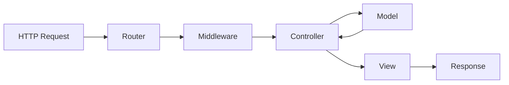

Aeros follows the Model-View-Controller (MVC) architectural pattern, providing a clean separation of concerns between your application's data, presentation, and business logic.

## Overview

The MVC architecture in Aeros separates your application into three main components:

- **Models** - Handle data and business logic
- **Views** - Manage presentation and user interface
- **Controllers** - Coordinate between models and views

## Controllers

Controllers are the entry point for handling HTTP requests and coordinating application logic. All controllers in Aeros extend the base `Controller` class.

### Creating controllers

Controllers should be placed in the `app/Controllers` directory and extend `Aeros\Src\Classes\Controller`:

```php app/Controllers/UserController.php
<?php

namespace App\Controllers;

use Aeros\Src\Classes\Controller;

class UserController extends Controller
{
    public function index()
    {
        return view('users.index');
    }
    
    public function show($id)
    {
        // Handle user display logic
        return view('users.show', ['id' => $id]);
    }
}
```

### Controller methods

Controller methods are automatically invoked by the router when a matching route is found. Parameters from the route are automatically injected into the method:

```php routes/web.php
<?php

use Aeros\Src\Classes\Router;

// Maps to UserController::show($id)
Router::get('/user/:id', 'UserController@show');
```

The router uses reflection to dynamically assign route parameters to controller method arguments (Route.php:188-201).

<Note>
If a route parameter doesn't match a method parameter name, Aeros will throw an exception.
</Note>

## Views

Views are responsible for rendering the presentation layer of your application. The `View` class handles template resolution and variable extraction.

### Rendering views

Use the `view()` helper function to render views:

```php
// Render a simple view
return view('welcome');

// Pass variables to the view
return view('users.profile', [
    'name' => 'John Doe',
    'email' => 'john@example.com'
]);
```

### View resolution

Views use dot notation for nested directories. The `View` class automatically resolves the path (View.php:52-57):

```php
// Resolves to: /views/users/profile.php
view('users.profile');

// Resolves to: /views/admin/dashboard.php
view('admin.dashboard');
```

### View variables

Variables passed to views are automatically extracted and made available as PHP variables:

```php
// In your controller
return view('user.profile', ['username' => 'john_doe']);
```

```php
<!-- In your view: views/user/profile.php -->
<h1>Welcome, <?= $username ?></h1>
```

### Flash variables

Aeros supports flash variables for one-time data (typically used after redirects):

```php
// Flash variables are automatically extracted in views
if (!empty($_SESSION['flash_vars'])) {
    extract($_SESSION['flash_vars']);
    $_SESSION['flash_vars'] = [];
}
```

## Models

Models represent your application's data layer and business logic. Aeros provides a base `Model` class for database interactions.

<Info>
For detailed information about working with models and database operations, see the [Models](/database/models) documentation.
</Info>

## Request flow

Here's how a typical request flows through the MVC architecture:



1. **Request** - HTTP request arrives at the application
2. **Router** - Matches the request to a registered route
3. **Middleware** - Executes any route middleware
4. **Controller** - Handles the request logic
5. **Model** - Performs data operations (if needed)
6. **View** - Renders the response template
7. **Response** - Sends the output back to the client

## Best practices

<CardGroup cols={2}>
  <Card title="Keep controllers thin" icon="weight-scale">
    Controllers should coordinate logic, not contain it. Move complex business logic to models or service classes.
  </Card>
  
  <Card title="Use type hints" icon="code">
    Leverage PHP type hints in controller methods for better code clarity and error prevention.
  </Card>
  
  <Card title="Organize views logically" icon="folder-tree">
    Use subdirectories to group related views (e.g., `users/`, `admin/`).
  </Card>
  
  <Card title="Validate input" icon="shield-check">
    Always validate and sanitize user input in your controllers before processing.
  </Card>
</CardGroup>

## Related resources

<CardGroup cols={2}>
  <Card title="Routing" icon="route" href="/routing/basic-routing">
    Learn how to define and manage routes
  </Card>
  <Card title="Request lifecycle" icon="arrows-rotate" href="/concepts/lifecycle">
    Understand how requests flow through Aeros
  </Card>
  <Card title="Middleware" icon="filter" href="/routing/middleware">
    Add layers to your request processing
  </Card>
  
  <Card title="Request lifecycle" icon="arrows-rotate" href="/concepts/lifecycle">
    Understand how requests are processed from start to finish
  </Card>
  
  <Card title="Middleware" icon="filter" href="/routing/middleware">
    Add middleware to filter and process requests
  </Card>
  
  <Card title="Service container" icon="box" href="/concepts/service-container">
    Manage dependencies with the service container
  </Card>
</CardGroup>