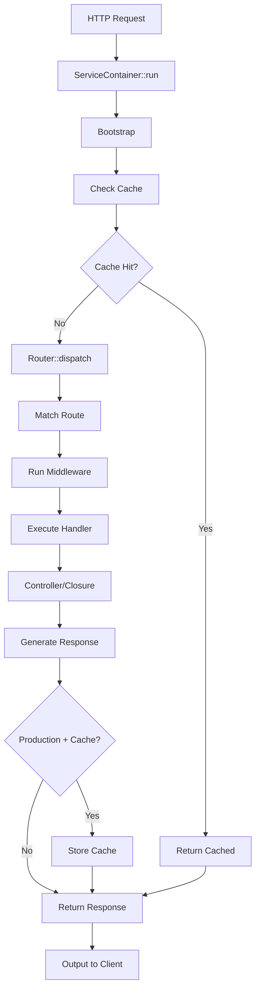

Understanding the request lifecycle is essential for building robust applications with Aeros. This guide walks through every step from when a request hits your application to when a response is sent back.

## Lifecycle overview

Every HTTP request in Aeros follows this flow:



## Entry point

All requests start at the `ServiceContainer::run()` method, which orchestrates the entire request lifecycle:

```php ServiceContainer.php:26-88
public function run()
{
    try {
        // Booting app
        $this->bootstrap();

        // Check cache for production
        if (isEnv('production') && env('CACHE')) {
            if ($content = cache('local')->getContent(/* ... */)) {
                printf('%s', response($content));
                exit;
            }
        }

        // Dispatch the route
        $content = app()->router->dispatch();

        // Validate content exists
        if (empty($content)) {
            throw new \TypeError("ERROR[route] No content found.");
        }

        // Store cache if enabled
        if (isEnv('production') && env('CACHE')) {
            cache('local')->create(/* ... */);
        }

        printf('%s', response($content));

    } catch (\Throwable $e) {
        // Error handling
    }

    exit;
}
```

## Bootstrap phase

Before processing any requests, Aeros bootstraps the application:

### 1. Boot application

Registers the main `AppServiceProvider` and sets up core functionality:

```php
public function bootApplication(): ServiceContainer
{
    if ($this->isAppBooted) {
        return $this;
    }

    (new \App\Providers\AppServiceProvider)->register();

    $this->isAppBooted = true;

    return $this;
}
```

### 2. Register providers

Loads all service providers from configuration and calls their `register()` methods:

```php
public function registerProviders(): ServiceContainer
{
    foreach ($this->getProviders() as $providerWithNamespace) {
        if ($this->isProvider($providerWithNamespace)) {
            (new $providerWithNamespace)->register();
        }
    }

    return $this;
}
```

<Info>
Providers are loaded based on execution mode. Web requests load providers from `config('app.providers.web')`, while CLI commands load from `config('app.providers.cli')`.
</Info>

### 3. Boot providers

Calls the `boot()` method on all registered providers:

```php
public function bootProviders(): ServiceContainer
{
    foreach ($this->getProviders() as $providerWithNamespace) {
        if ($this->isProvider($providerWithNamespace)) {
            (new $providerWithNamespace)->boot();
        }
    }

    return $this;
}
```

The complete bootstrap chain (ServiceContainer.php:95-100):

```php
public function bootstrap(): ServiceContainer
{
    return $this->bootApplication()
            ->registerProviders()
            ->bootProviders();
}
```

## Caching layer

In production environments with caching enabled, Aeros checks for cached route content before processing:

### Cache check

```php
if (isEnv('production') && env('CACHE')) {
    $hash = Route::getRouteHash();
    $cachePath = app()->basedir . '/logs/cache/' . $hash . '.log';
    
    if ($content = cache('local')->getContent($cachePath)) {
        printf('%s', response($content));
        exit;
    }
}
```

The route hash is generated from the request method, URI, and payload (Route.php:147-153):

```php
public static function getRouteHash(string $hash = 'sha256'): string
{
    return hash(
        $hash, 
        $_SERVER['REQUEST_METHOD'] . ':' . 
        $_SERVER['REQUEST_URI'] . ':' . 
        serialize(request()->getPayload())
    );
}
```

### Cache storage

After generating content, Aeros stores it in the cache:

```php
if (isEnv('production') && env('CACHE')) {
    cache('local')->create(
        app()->basedir . '/logs/cache/' . Route::getRouteHash() . '.log', 
        $content
    );
}
```

<Warning>
Cache is only active in production mode when `env('CACHE')` is enabled.
</Warning>

## Route dispatching

The router matches the incoming request to a registered route and executes the handler.

### 1. Match route

The router parses the request URI and matches it against registered routes:

```php
public function dispatch(): mixed
{
    $route = $this->match($_SERVER['REQUEST_METHOD'], $_SERVER['REQUEST_URI']);

    if (! $route) {
        throw new \Exception(
            sprintf(
                "ERROR[route] Route '%s:%s' does not match any registered route.",
                $_SERVER['REQUEST_METHOD'],
                $_SERVER['REQUEST_URI']
            )
        );
    }

    // ...
}
```

### 2. Parse URI

The router breaks down the URI into parts and extracts subdomains:

```php Router.php:201-226
public function getUriParts(string $uri): array
{
    // Remove query string
    $uri = str_replace('?' . $_SERVER['QUERY_STRING'], '', $uri);

    $uriParts = [
        'parts' => array_values(
            array_filter(
                explode('/', $uri)
            )
        ),
        'subdomain' => '*'
    ];

    // If no URI parts, add default index '/'
    if (empty($uriParts['parts'])) {
        $uriParts['parts'][] = '/';
    }

    // Check for subdomain
    if (substr_count($_SERVER['HTTP_HOST'], '.') == 2) {
        $uriParts['subdomain'] = explode('.', $_SERVER['HTTP_HOST'])[0];
    }

    return $uriParts;
}
```

### 3. Dynamic parameters

Routes can contain dynamic parameters that are extracted and passed to handlers:

```php routes/web.php
Router::get('/user/:id/posts/:postId', 'UserController@showPost');
```

The router matches tokens and assigns parameter values (Router.php:178-189):

```php
// Assigns values to params for current route
$params = [];

foreach ($route->params as $name => $index) {
    $params[$name] = $currentUriParts['parts'][$index-1];
}

$route->params = $params;
```

## Middleware execution

Before executing the route handler, Aeros runs all registered middleware:

```php
public function dispatch(): mixed
{
    $route = $this->match($_SERVER['REQUEST_METHOD'], $_SERVER['REQUEST_URI']);

    // Run middleware for this route
    self::runMiddlewares($route->getMiddlewares());

    $this->currentRoute = $route;

    return $route->handler()->getContent();
}
```

Middleware are executed sequentially (Router.php:318-334):

```php
public static function runMiddlewares(array $middlewares): void
{
    foreach ($middlewares as $middleware) {
        if (! in_array(MiddlewareInterface::class, class_implements($middleware))) {
            throw new \Exception(
                sprintf(
                    "ERROR[middleware] Middleware '%s' does not exist or is invalid.",
                    $middleware
                )
            );
        }

        // Pass request and response instances
        (new $middleware())(app()->request, app()->response);
    }
}
```

<Info>
Middleware can modify the request/response or terminate execution early (e.g., for authentication failures).
</Info>

## Handler execution

After middleware passes, the route handler is executed. Handlers can be closures or controller methods.

### Closure handlers

```php routes/web.php
Router::get('/hello', function() {
    return 'Hello, World!';
});
```

### Controller handlers

```php routes/web.php
Router::get('/users/:id', 'UserController@show');
```

The handler method determines the type and executes accordingly (Route.php:116-128):

```php
public function handler(): Route
{
    if (is_callable($this->handler)) {
        $this->content = ($this->handler)();
    }

    // Controller name
    if (is_string($this->handler)) {
        $this->content = $this->callController($this->handler);
    }

    return $this;
}
```

### Controller resolution

For controller handlers, Aeros resolves the controller and method, then uses reflection to inject parameters:

```php Route.php:162-210
private function callController(string $controller): string
{
    ob_start();

    // Parse controller and method
    [$controllerName, $method] = strpos($controller, '@') === false
                                ? [$controller, 'index']
                                : explode('@', $controller);

    $controllerName = "\\App\\Controllers\\$controllerName";

    // Validate controller exists
    if (get_parent_class($controllerName) != \Aeros\Src\Classes\Controller::class) {
        throw new \Exception(
            sprintf('ERROR[Controller] Problem validating controller \'%s\'.', $controllerName)
        );
    }

    // Validate method exists
    if (! method_exists($controllerName, $method)) {
        throw new \Exception(
            sprintf('ERROR[Controller] Method \'%s::%s\' does not exist.', $controllerName, $method)
        );
    }

    $controller = new $controllerName;
    $reflectionMethod = new \ReflectionMethod($controller, $method);
    $arguments = [];

    // Inject route parameters
    foreach ($reflectionMethod->getParameters() as $param) {
        if (! isset($this->params[':' . $param->name])) {
            throw new \Exception(
                sprintf('ERROR[Route] Parameter \'%s\' not in route \'%s\'.', $param->name, $this->path)
            );
        }

        $arguments[] = $this->params[':' . $param->name];
    }

    printf('%s', $reflectionMethod->invokeArgs($controller, $arguments));

    $content = ob_get_contents();
    ob_end_clean();

    return $content;
}
```

## Response generation

After the handler executes, the response is processed and sent to the client:

```php
$content = app()->router->dispatch();

if (empty($content)) {
    throw new \TypeError("ERROR[route] No content found.");
}

printf('%s', response($content));
```

The `response()` helper wraps content with appropriate headers and formatting.

## Error handling

The lifecycle includes comprehensive error handling:

```php ServiceContainer.php:57-85
catch (\Throwable $e) {
    // Log errors only on production
    if (isEnv('production')) {
        logger(
            sprintf(
                'Caught %s: %s. %s:%d.', 
                get_class($e),
                $e->getMessage(),
                $e->getFile(),
                $e->getLine()
            )
        );

        exit;
    }

    // For development environment
    printf(
        'Caught %s: %s. %s:%d.', 
        get_class($e),
        $e->getMessage(),
        $e->getFile(),
        $e->getLine()
    );
}
```

<Warning>
In production, errors are logged but not displayed. In development, full error details are shown.
</Warning>

## Request object initialization

The `Request` class is initialized early in the lifecycle and sanitizes all input:

```php Request.php:81-100
public function __construct()
{
    // Sanitize superglobals
    $this->cookies = $this->sanitizeInput($_COOKIE);
    $this->queryParams = $this->sanitizeInput($_GET);
    $this->requestParams = $this->sanitizeInput($_POST);

    $this->url($_SERVER['PHP_SELF'])
        ->uri()
        ->method()
        ->headers(getallheaders())
        ->query()
        ->subdomain()
        ->domain();
}
```

## Lifecycle summary

<Steps>
  <Step title="ServiceContainer::run()">
    Entry point for all requests
  </Step>
  
  <Step title="Bootstrap">
    Initialize application and register service providers
  </Step>
  
  <Step title="Cache check">
    Return cached content if available (production only)
  </Step>
  
  <Step title="Router::dispatch()">
    Match request to registered route
  </Step>
  
  <Step title="Parse URI">
    Extract route parameters and subdomain
  </Step>
  
  <Step title="Run middleware">
    Execute middleware stack sequentially
  </Step>
  
  <Step title="Execute handler">
    Invoke closure or controller method
  </Step>
  
  <Step title="Generate response">
    Process and format the response
  </Step>
  
  <Step title="Store cache">
    Save response to cache (production only)
  </Step>
  
  <Step title="Output">
    Send response to client and terminate
  </Step>
</Steps>

## Related resources

<CardGroup cols={2}>
  <Card title="Service container" icon="box" href="/concepts/service-container">
    Learn about dependency injection and service registration
  </Card>
  
  <Card title="Routing" icon="route" href="/routing/basic-routing">
    Understand route definition and matching
  </Card>
  
  <Card title="Middleware" icon="filter" href="/routing/middleware">
    Add middleware to filter requests
  </Card>
  
  <Card title="Architecture" icon="building" href="/concepts/architecture">
    Learn about MVC architecture in Aeros
  </Card>
</CardGroup>